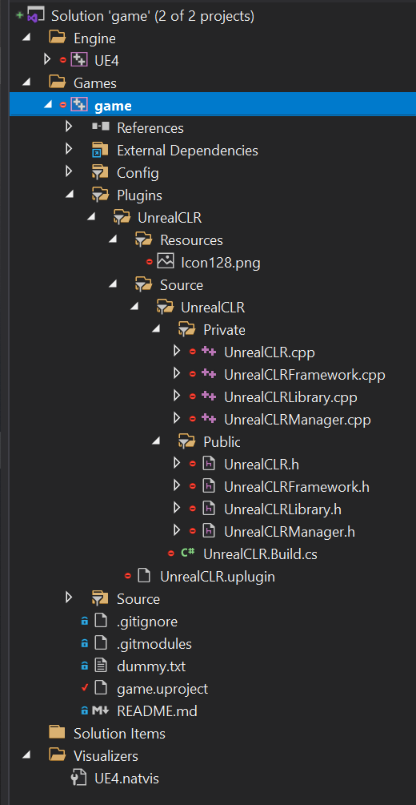

# How to develop

## Windows

To add new bindings it is necessary to edit both the API in the C# sources and the underlying calls done in the C++ sources. Instructions for each can be found below.

### Editing the C++ files
To edit the C++ files with instant feedback it is recommended to create a dummy C++ Unreal Engine project (don't fiddle with a blueprint project) and install the plugin to it (following the instructions in the README). The Unreal Engine then creates for you the solution and project file with all necessary further references.

After this is done it should in theory look like this then.

Now you can edit all C++ files of the plugin with Intellisense support.

To add bindings here take a look into the files `UnrealCLR.h`, `UnrealCLRFramework.cpp` and lastly `UnrealCLR.cpp`.

Beware that you should copy any file changes you made there over to the place where your local clone of the repository is (you're currently editing the files which can be found within the dummy project at `Plugins/UnrealCLR/Sources/...` and they belong to `PATH_TO_REPO/Source/Native/...`).

### Editing the C# files / API

To edit the C# API you just need to open the csproj file in `PATH_TO_REPO/Source/Managed/Framework/Codegen.cs`.

If you want to add new bindings you need to add the entries both in the `Codegen.cs` and the `Framework.cs`. To see how exactly it works take a look into existing bindings and try to mimic that.
